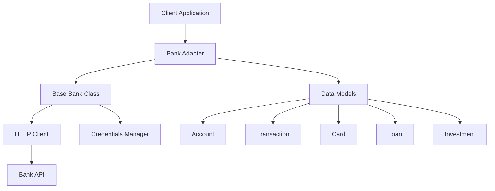
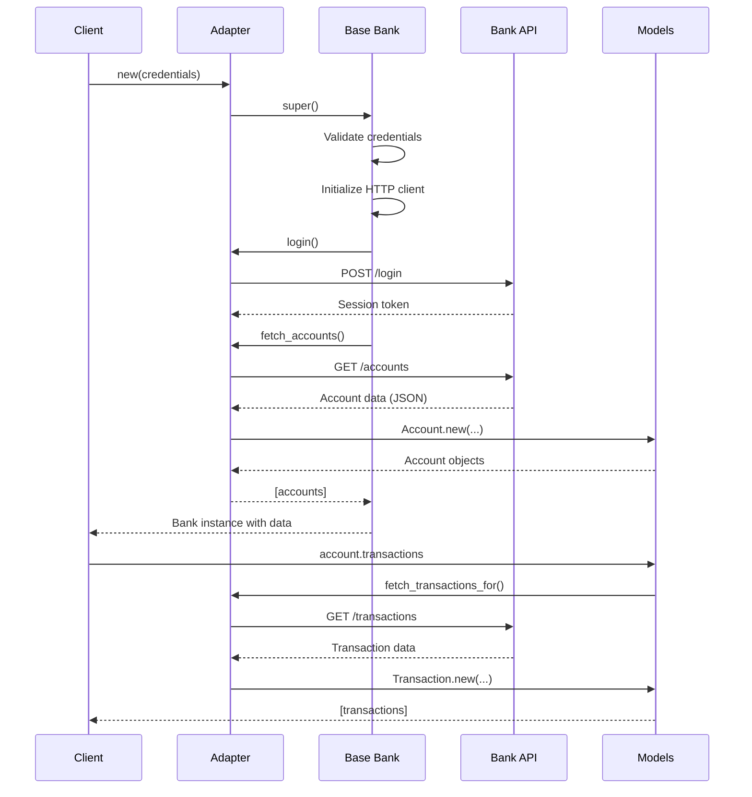

## Overview

BankScrap is built on a flexible, adapter-based architecture that separates core framework functionality from bank-specific implementation details. This design enables you to interact with multiple banks through a unified interface while allowing each bank adapter to handle its unique authentication and data retrieval requirements.

## Core Components

The BankScrap framework consists of several key components:



### Framework Core

The framework core (`lib/bankscrap.rb`) provides:

- **Module configuration**: Global settings for logging, debugging, and proxy configuration
- **Dependency management**: Loading all required libraries and components
- **Base classes**: Foundation classes that all adapters inherit from
- **Error handling**: Custom exception types like `NotMoneyObjectError`

```ruby lib/bankscrap.rb
module Bankscrap
  class << self
    attr_accessor :log      # Enable/disable logging
    attr_accessor :debug    # Enable/disable debug mode
    attr_accessor :proxy    # Configure HTTP proxy
  end

  # Global configuration
  self.log = false
  self.debug = false
end
```

### Base Bank Class

The `Bankscrap::Bank` class (see [Bank Class](/concepts/bank-class)) provides:

- Credential validation and management
- HTTP client initialization with Mechanize
- Lifecycle hooks for login and data fetching
- Abstract interface methods that adapters must implement

### Data Models

BankScrap defines five core data models (see [Data Models](/concepts/models)):

- **Account**: Bank accounts with balance and transaction history
- **Transaction**: Individual financial transactions
- **Card**: Credit and debit cards
- **Loan**: Loan products
- **Investment**: Investment products

All models use the `Money` gem for currency handling, ensuring precise financial calculations.

## Design Patterns

### Template Method Pattern

The base `Bank` class uses the template method pattern to define the skeleton of the initialization algorithm:

```ruby lib/bankscrap/bank.rb
def initialize(credentials = {})
  # 1. Validate and assign credentials
  self.class::REQUIRED_CREDENTIALS.each do |field|
    # ...
  end

  # 2. Initialize HTTP client
  initialize_http_client

  # 3. Allow adapter customization
  yield if block_given?

  # 4. Execute login
  login

  # 5. Fetch all available data
  @accounts = fetch_accounts
  @investments = fetch_investments if respond_to?(:fetch_investments)
  @loans = fetch_loans if respond_to?(:fetch_loans)
  @cards = fetch_cards if respond_to?(:fetch_cards)
end
```

Adapters override specific methods (`login`, `fetch_accounts`, etc.) while the framework handles the orchestration.

### Adapter Pattern

Each bank implements its own adapter by:

1. Creating a new gem (`bankscrap-bankname`)
2. Subclassing `Bankscrap::Bank`
3. Implementing required interface methods
4. Defining bank-specific credentials

See [Adapter Pattern](/concepts/adapters) for details.

### Lazy Loading

Transactions are loaded lazily to improve performance:

```ruby lib/bankscrap/account.rb
def transactions
  @transactions ||= bank.fetch_transactions_for(self)
end
```

Transactions are only fetched when first accessed, not during account initialization.

## HTTP Communication

BankScrap uses the **Mechanize** gem for HTTP communication, providing:

- Cookie management for session handling
- SSL certificate verification control
- Custom user agent strings (mobile browser emulation)
- Proxy support for debugging
- Request/response logging in debug mode

```ruby lib/bankscrap/bank.rb
def initialize_http_client
  @http = Mechanize.new do |mechanize|
    mechanize.user_agent = WEB_USER_AGENT
    mechanize.agent.http.verify_mode = OpenSSL::SSL::VERIFY_NONE
    mechanize.log = Logger.new(STDOUT) if Bankscrap.debug

    if Bankscrap.proxy
      mechanize.set_proxy Bankscrap.proxy[:host], Bankscrap.proxy[:port]
    end
  end
end
```

## Credential Management

Credentials can be provided in two ways:

1. **Directly during initialization**:
   ```ruby
   bank = Bankscrap::MyBank::Bank.new(user: 'john', password: 'secret')
   ```

2. **Via environment variables**:
   ```bash
   export BANKSCRAP_MYBANK_USER=john
   export BANKSCRAP_MYBANK_PASSWORD=secret
   ```

The framework automatically falls back to environment variables if credentials aren't provided directly.

## Data Flow

Typical data flow when using BankScrap:



## Extension Points

The framework provides several extension points for customization:

### Custom Headers

Adapters can add custom HTTP headers:

```ruby
add_headers('Authorization' => "Bearer #{token}")
```

### Temporary Headers

Use headers for a specific request block:

```ruby
with_headers('X-Request-ID' => request_id) do
  response = get(url)
end
```

### Optional Features

Adapters can optionally implement:

- `fetch_investments` - For banks offering investment products
- `fetch_loans` - For banks offering loan products  
- `fetch_cards` - For banks offering card products

The framework checks if these methods exist before calling them:

```ruby lib/bankscrap/bank.rb
@investments = fetch_investments if respond_to?(:fetch_investments)
@loans = fetch_loans if respond_to?(:fetch_loans)
@cards = fetch_cards if respond_to?(:fetch_cards)
```

## Generator System

BankScrap includes a generator to scaffold new adapters:

```bash
bankscrap generate MyBank
```

This creates:
- Complete gem structure
- Template bank adapter class
- RSpec test suite setup
- Documentation templates
- Build configuration

See [Creating Adapters](/adapters/generator) for a complete walkthrough.

## Error Handling

### Credential Validation

The framework validates that all required credentials are provided:

```ruby lib/bankscrap/bank.rb
self.class::REQUIRED_CREDENTIALS.each do |field|
  value = credentials[field] || ENV["#{env_vars_prefix}_#{field.upcase}"]
  raise MissingCredential, "Missing credential: '#{field}'" if value.blank?
end
```

### Money Object Validation

All monetary amounts must be `Money` objects:

```ruby
raise NotMoneyObjectError, :balance unless params[:balance].is_a?(Money)
```

This ensures:
- Correct currency handling
- Precision in financial calculations
- Type safety across the framework

## Best Practices

<CardGroup cols={2}>
  <Card title="Inherit from Bank" icon="sitemap">
    Always extend `Bankscrap::Bank` for new adapters to inherit framework functionality
  </Card>
  
  <Card title="Use Money Objects" icon="coins">
    Always use `Money` objects for amounts to ensure precision and currency awareness
  </Card>
  
  <Card title="Implement Required Methods" icon="list-check">
    All adapters must implement `login`, `fetch_accounts`, and `fetch_transactions_for`
  </Card>
  
  <Card title="Handle Errors Gracefully" icon="shield-exclamation">
    Provide clear error messages when API calls fail or data is malformed
  </Card>
</CardGroup>

## Next Steps

<CardGroup cols={2}>
  <Card title="Adapter Pattern" icon="puzzle-piece" href="/concepts/adapters">
    Learn how to create custom bank adapters
  </Card>
  
  <Card title="Bank Class" icon="building-columns" href="/concepts/bank-class">
    Deep dive into the Bank base class
  </Card>
  
  <Card title="Data Models" icon="database" href="/concepts/models">
    Explore all data models in detail
  </Card>
  
  <Card title="Creating Adapters" icon="code" href="/adapters/generator">
    Step-by-step guide to building your first adapter
  </Card>
</CardGroup>