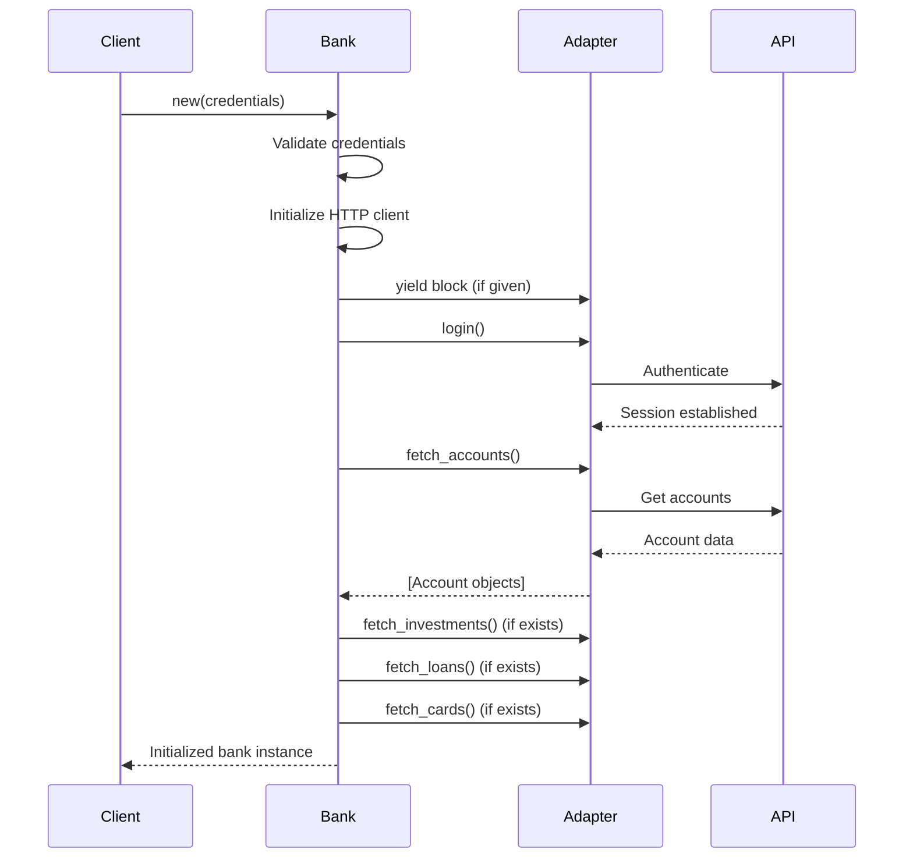

## Overview

The `Bankscrap::Bank` class is the foundation of all bank adapters. It provides credential management, HTTP communication, and a structured lifecycle for fetching financial data.

<Note>
  All bank adapters inherit from this class and implement its abstract interface methods.
</Note>

## Class Definition

```ruby lib/bankscrap/bank.rb
module Bankscrap
  class Bank
    attr_accessor :headers, :accounts, :cards, :loans, :investments
    
    REQUIRED_CREDENTIALS = %i[user password].freeze
    
    def initialize(credentials = {})
      # Implementation details...
    end
  end
end
```

## Attributes

The Bank class exposes these public attributes:

| Attribute | Type | Description |
|-----------|------|-------------|
| `headers` | `Hash` | HTTP headers used for API requests |
| `accounts` | `Array<Account>` | All accounts for the authenticated user |
| `cards` | `Array<Card>` | All cards (if supported by bank) |
| `loans` | `Array<Loan>` | All loans (if supported by bank) |
| `investments` | `Array<Investment>` | All investments (if supported by bank) |

## Constants

### `WEB_USER_AGENT`

Default user agent string that emulates a mobile browser:

```ruby lib/bankscrap/bank.rb
WEB_USER_AGENT = 'Mozilla/5.0 (Linux; Android 4.2.1; en-us; Nexus 4 Build/JOP40D) ' \
                 'AppleWebKit/535.19 (KHTML, like Gecko) ' \
                 'Chrome/18.0.1025.166 Mobile Safari/535.19'.freeze
```

<Info>
  Many banks have better support for mobile APIs than web scraping, making mobile user agents more reliable.
</Info>

### `REQUIRED_CREDENTIALS`

Defines which credentials are required for authentication:

```ruby
REQUIRED_CREDENTIALS = %i[user password].freeze
```

Adapters override this constant to specify their required credentials:

```ruby
module Bankscrap
  module MyBank
    class Bank < ::Bankscrap::Bank
      REQUIRED_CREDENTIALS = %i[customer_id pin].freeze
    end
  end
end
```

## Initialization Lifecycle

The `initialize` method orchestrates the entire setup process:



### Step 1: Credential Validation

```ruby lib/bankscrap/bank.rb
self.class::REQUIRED_CREDENTIALS.each do |field|
  value = credentials.with_indifferent_access[field] || 
          ENV["#{env_vars_prefix}_#{field.upcase}"]
  raise MissingCredential, "Missing credential: '#{field}'" if value.blank?
  instance_variable_set("@#{field}", value)
end
```

**Behavior**:
1. Checks for credentials in the `credentials` hash
2. Falls back to environment variables if not provided
3. Raises `MissingCredential` error if any required credential is missing
4. Sets instance variables for each credential (e.g., `@user`, `@password`)

**Environment variable format**: `BANKSCRAP_BANKNAME_FIELDNAME`

Example:
```bash
export BANKSCRAP_MYBANK_USER=john
export BANKSCRAP_MYBANK_PASSWORD=secret123
```

### Step 2: HTTP Client Initialization

```ruby lib/bankscrap/bank.rb
def initialize_http_client
  @http = Mechanize.new do |mechanize|
    mechanize.user_agent = WEB_USER_AGENT
    mechanize.agent.http.verify_mode = OpenSSL::SSL::VERIFY_NONE
    mechanize.log = Logger.new(STDOUT) if Bankscrap.debug

    if Bankscrap.proxy
      mechanize.set_proxy Bankscrap.proxy[:host], Bankscrap.proxy[:port]
    end
  end

  @headers = {}
end
```

**Features**:
- Uses Mechanize for HTTP communication
- Disables SSL verification (for banks with certificate issues)
- Enables logging in debug mode
- Configures proxy if specified
- Initializes empty headers hash

### Step 3: Adapter Customization

```ruby lib/bankscrap/bank.rb
yield if block_given?
```

Adapters can provide a block to customize initialization:

```ruby
module Bankscrap
  module MyBank
    class Bank < ::Bankscrap::Bank
      def initialize(credentials = {})
        super do
          # Custom initialization logic
          @device_id = SecureRandom.hex(16)
          add_headers('X-Device-ID' => @device_id)
        end
      end
    end
  end
end
```

### Step 4: Login

```ruby lib/bankscrap/bank.rb
login
```

Calls the adapter's `login` method to authenticate with the bank's API.

### Step 5: Data Fetching

```ruby lib/bankscrap/bank.rb
@accounts = fetch_accounts

# Optional features
@investments = fetch_investments if respond_to?(:fetch_investments)
@loans = fetch_loans if respond_to?(:fetch_loans)
@cards = fetch_cards if respond_to?(:fetch_cards)
```

**Behavior**:
- Always fetches accounts (required)
- Only fetches investments, loans, and cards if the adapter implements those methods

## Abstract Interface Methods

These methods **must** be implemented by all adapters:

### `login`

Establish a session with the bank's API.

```ruby lib/bankscrap/bank.rb
def login
  raise "#{self.class} should implement a login method"
end
```

**Adapter implementation**:
```ruby
def login
  response = post(LOGIN_ENDPOINT, fields: {
    user: @user,
    password: @password
  }.to_json)
  
  token = JSON.parse(response)['access_token']
  add_headers('Authorization' => "Bearer #{token}")
end
```

### `fetch_accounts`

Retrieve all accounts for the authenticated user.

```ruby lib/bankscrap/bank.rb
def fetch_accounts
  raise "#{self.class} should implement a fetch_account method"
end
```

**Must return**: `Array<Bankscrap::Account>`

**Adapter implementation**:
```ruby
def fetch_accounts
  response = get(ACCOUNTS_ENDPOINT)
  data = JSON.parse(response)
  
  data['accounts'].map do |account_data|
    Account.new(
      bank: self,
      id: account_data['id'],
      name: account_data['name'],
      balance: Money.new(account_data['balance'], 'EUR'),
      available_balance: Money.new(account_data['available'], 'EUR'),
      iban: account_data['iban']
    )
  end
end
```

### `fetch_transactions_for`

Retrieve transactions for a specific account.

```ruby lib/bankscrap/bank.rb
def fetch_transactions_for(*)
  raise "#{self.class} should implement a fetch_transactions method"
end
```

**Parameters**:
- `account` - `Bankscrap::Account` object
- `start_date:` - Start of date range (keyword argument)
- `end_date:` - End of date range (keyword argument)

**Must return**: `Array<Bankscrap::Transaction>`

**Adapter implementation**:
```ruby
def fetch_transactions_for(account, start_date: Date.today - 1.month, end_date: Date.today)
  response = post(TRANSACTIONS_ENDPOINT, fields: {
    account_id: account.id,
    from: start_date.strftime('%Y-%m-%d'),
    to: end_date.strftime('%Y-%m-%d')
  }.to_json)
  
  data = JSON.parse(response)
  data['transactions'].map do |tx|
    Transaction.new(
      account: account,
      id: tx['id'],
      amount: Money.new(tx['amount'], tx['currency']),
      description: tx['description'],
      effective_date: Date.parse(tx['date'])
    )
  end
end
```

## HTTP Helper Methods

The Bank class provides convenient HTTP methods for adapter implementations:

### `get(url, params:, referer:)`

Perform an HTTP GET request.

```ruby lib/bankscrap/bank.rb
def get(url, params: [], referer: nil)
  @http.get(url, params, referer, @headers).body
end
```

**Parameters**:
- `url` - Full URL to request
- `params` - Array of `[key, value]` pairs for query string (optional)
- `referer` - Referer header value (optional)

**Returns**: Response body as string

**Example**:
```ruby
# Simple GET
response = get('https://api.bank.com/accounts')

# With query parameters
response = get('https://api.bank.com/search', params: [
  ['query', 'transactions'],
  ['limit', '50']
])

# With referer
response = get('https://api.bank.com/details', referer: 'https://bank.com/home')
```

### `post(url, fields:)`

Perform an HTTP POST request.

```ruby lib/bankscrap/bank.rb
def post(url, fields: {})
  @http.post(url, fields, @headers).body
end
```

**Parameters**:
- `url` - Full URL to request
- `fields` - Hash or string for request body

**Returns**: Response body as string

**Example**:
```ruby
# JSON POST
response = post('https://api.bank.com/auth', fields: {
  username: @user,
  password: @password
}.to_json)

# Form POST
response = post('https://api.bank.com/submit', fields: {
  field1: 'value1',
  field2: 'value2'
})
```

### `put(url, fields:)`

Perform an HTTP PUT request.

```ruby lib/bankscrap/bank.rb
def put(url, fields: {})
  @http.put(url, fields, @headers).body
end
```

**Parameters**: Same as `post`

**Example**:
```ruby
response = put('https://api.bank.com/settings', fields: {
  notifications: true
}.to_json)
```

## Header Management

### `add_headers(headers)`

Add or update HTTP headers for all subsequent requests.

```ruby lib/bankscrap/bank.rb
def add_headers(headers)
  @headers.merge! headers
  @http.request_headers = @headers
end
```

**Example**:
```ruby
add_headers(
  'Authorization' => 'Bearer token123',
  'X-API-Version' => '2.0'
)
```

### `with_headers(tmp_headers)`

Temporarily use different headers for a code block.

```ruby lib/bankscrap/bank.rb
def with_headers(tmp_headers)
  current_headers = @headers
  add_headers(tmp_headers)
  yield
ensure
  add_headers(current_headers)
end
```

**Example**:
```ruby
with_headers('X-Request-ID' => SecureRandom.uuid) do
  response = get('https://api.bank.com/special-endpoint')
end
# Original headers are restored here
```

## Utility Methods

### `account_with_iban(iban)`

Find an account by its IBAN.

```ruby lib/bankscrap/bank.rb
def account_with_iban(iban)
  accounts.find do |account|
    account.iban.delete(' ') == iban.delete(' ')
  end
end
```

**Example**:
```ruby
account = bank.account_with_iban('ES12 3456 7890 1234 5678 9012')
puts account.balance
```

### `initialize_cookie(url)`

Initialize cookies by visiting a URL (useful for session setup).

```ruby lib/bankscrap/bank.rb
def initialize_cookie(url)
  @http.get(url).body
end
```

**Example**:
```ruby
def login
  # Visit home page to get session cookie
  initialize_cookie('https://www.bank.com')
  
  # Now perform login
  post(LOGIN_ENDPOINT, fields: credentials)
end
```

### `log(msg)`

Log a message if logging is enabled.

```ruby lib/bankscrap/bank.rb
def log(msg)
  puts msg if Bankscrap.log
end
```

**Example**:
```ruby
log "Fetching accounts for user #{@user}"
```

**Enable logging**:
```ruby
Bankscrap.log = true
```

## Exception Classes

### `MissingCredential`

Raised when a required credential is not provided.

```ruby lib/bankscrap/bank.rb
class MissingCredential < ArgumentError; end
```

**Example**:
```ruby
begin
  bank = Bankscrap::MyBank::Bank.new(user: 'john')
rescue Bankscrap::Bank::MissingCredential => e
  puts "Error: #{e.message}"
  # => "Error: Missing credential: 'password'"
end
```

## Usage Examples

### Basic Usage

```ruby
bank = Bankscrap::MyBank::Bank.new(
  user: 'john.doe',
  password: 'secret123'
)

# Access accounts
bank.accounts.each do |account|
  puts "#{account.name}: #{account.balance.format}"
end

# Access other products (if available)
bank.cards.each { |card| puts card.name }
bank.loans.each { |loan| puts loan.description }
bank.investments.each { |inv| puts inv.name }
```

### Using Environment Variables

```bash
export BANKSCRAP_MYBANK_USER=john.doe
export BANKSCRAP_MYBANK_PASSWORD=secret123
```

```ruby
# Credentials loaded automatically from environment
bank = Bankscrap::MyBank::Bank.new
```

### Finding Specific Accounts

```ruby
bank = Bankscrap::MyBank::Bank.new(credentials)

# By IBAN
checking = bank.account_with_iban('ES12 3456 7890 1234 5678 9012')

# By name
savings = bank.accounts.find { |a| a.name.include?('Savings') }

# By balance
richest = bank.accounts.max_by(&:balance)
```

## Best Practices

<CardGroup cols={2}>
  <Card title="Always Use Money" icon="coins">
    Never use floats for amounts. Always create `Money` objects to ensure precision.
  </Card>
  
  <Card title="Validate Responses" icon="check-circle">
    Check that API responses are valid before parsing to avoid cryptic errors.
  </Card>
  
  <Card title="Store Raw Data" icon="database">
    Keep original API responses in the `raw_data` field for debugging.
  </Card>
  
  <Card title="Handle Errors Gracefully" icon="shield-exclamation">
    Provide clear error messages when authentication or API calls fail.
  </Card>
</CardGroup>

## Next Steps

<CardGroup cols={2}>
  <Card title="Adapter Pattern" icon="puzzle-piece" href="/concepts/adapters">
    Learn how to implement bank adapters
  </Card>
  
  <Card title="Data Models" icon="shapes" href="/concepts/models">
    Explore Account, Transaction, and other models
  </Card>
  
  <Card title="Creating Adapters" icon="code" href="/adapters/generator">
    Step-by-step guide to building adapters
  </Card>
  
  <Card title="Architecture" icon="sitemap" href="/concepts/architecture">
    Understanding the overall system design
  </Card>
</CardGroup>